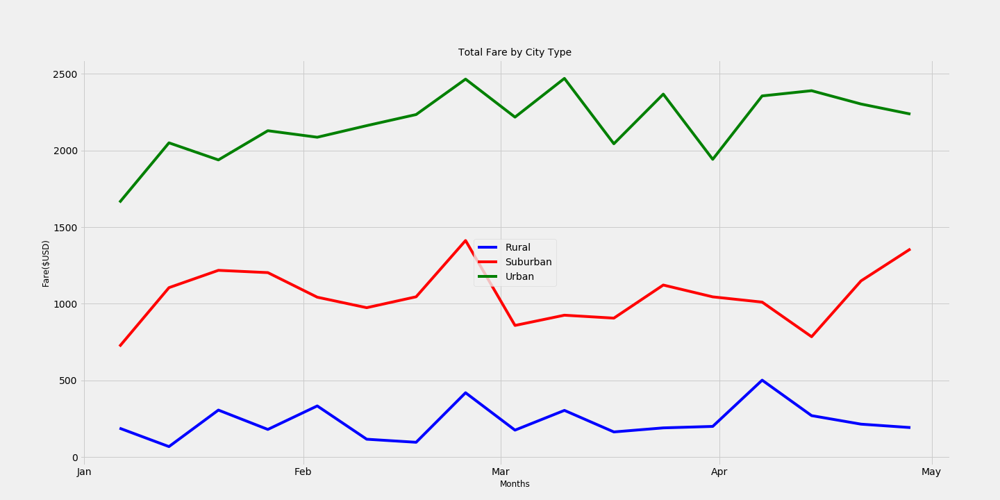

# PyBer_Analysis
Data analysis for ride share app
# PyBer Analysis Report
This report to analyse PyBer's fare according to city type. This report includes graph for given year and given month rage fares in USD. 
There are three type if cities ploted in the graph.
Also Table shows each type of cities have is total fare, total number of drivers and total rides. Also calculates Average per ride and Average per driver. 

## Background and Results
Data was collected by PyBer with in different CSV file. City data csv file had different cities and devided into type of cities with number of driver. ride_data.csv file has cities and fare according to dates and ride id. Both the files has city as a common column.
### Purpose
The purpose of this is to get an idea how each type of city is doing (fare wise) in different months. This way we will get an idea which months are better performing (fare wise)
Also table report shows what each city type's average fare per ride and average fare per driver 
### Technical Analysis
To perform the analysis used pandas and matplotlib libraries to extract the required data and visualize the data.
* Reading of resource file is done by pandas read_csv

   
   
 
* Merged City and Right data
  
  
* Renamed columns
  
  
* Set index to Date column
  
  
* New DataFrame with only City Type and Fare columns

  
  
* Set the index to the datetime data type.
  
  
* Calculate the sum() of fares by the type of city and date using groupby() to create a Series. Convert series to DataFrame
  
  
* Create a pivot table DataFrame with the Date as the index and columns = 'City Type'
  
  
* Create DataFrame on the given dates, '2019-01-01':'2019-04-28''
  
  
* Create DataFrame with resample() in weekly bins, and calculate the sum() of the fares for each week in the resampled data.'
  
  
### Results
PyBer Per City type summary which includes total fare, total rides, total drivers amd average fare per ride and average fare per drivers summary


Plot shows Total fare by City types per month in that year. Each type is color coded in different color. Also with the help of graph we can see which months has high Fare.

### Summary
Accring to summary data frame Rual city type is higher average fare per ride and also higher average fare per driver as total number of rides and total number of drivers are less as compared with total fare. 
## Challenges Encountered and Overcome
* It took some time to understand the data and their relationship between two input files.
* Pandas is very poweful tool but uses is kind of hard. Ueses certain type of way to extract data. So needed to use exact technique also needed to follow certain order to do certain things
* Needed to read pandas and matplotlib documentation to do certain things. Like grouping or resampling or creating pivot table.
* Also in challenge certain steps were not clear. Took TAs help to understand what a perticular step is telling you do.
* Module challenge stucture was not organized properly. Needed to read couple of times to understand challenge.
### Challenges and Difficulties Encountered

* Programming
  * Certain things in challenge steps were not coverded or mentioned in module. Example deleting index, copy columns using copy() function.
  ```
  selected_columns = pyber_data_rename_df[["City Type", "Fare"]]
  citytype_fare_df = selected_columns.copy()
  ```
* Data analysis
  * Need more information. Merging data connected dots but indexing and relationship with Date, City Type and Fare made it more confusing
* Graphing, etc
  * Used Object Orianted approch to plot the data but it was hard to plot x-axis label. Date was in full format and needed to convert it into month. Used matplotlib library function but needed to get months.
### Technical Analyses Used
Used pandas and matplotlib to perform data extration and visualize the data. pandas can read the csv file and convert into dataframe which can be used for data extraction.
matplotlib provides very useful and fexible plotting methods where we can plot multiple data in a single plot so that its easy for comparision.
## Recommendations and Next Steps
To get more information we can use boxplot so that we can see all the information provided by describe() in a plot and that way its easy to find outlyers. 
Boxplot can give us information like mean, mediun etc.
### Recommendations for Future Analysis
* We can analyse driver count per city and fare relationship.
* Per weekly number of drtivers per city type, this way we know which months have lowest number of drivers.
* Also can findout how number of drivers and fare is corelated.
### Additional Analysis 1

* Description of Approach
Number of drivers per month per city type can be analysed. From this we can findout which month(s) has maximum number of drivers and which month(s) has minimum number of drivers.
* Technical Steps
Mearged data group by City Type and Driver Count. Makesure index is set to Date and Date and its type is datetime. Resample the data into weeks and plot the graph per month and number of drivers each month.
### Additional Analysis 2

* Description of Approach
Find the outlyers in the Total fare by City Type.
* Technical Steps
Use boxplot for all different types of cities and fare and plot graph. This way if there are any outlyers we will see in boxplot.
